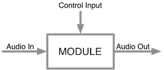
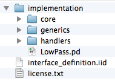

# Integra Live Architectural Overview and XML Compatibility Requirements

This document provides and explanation of the Integra Live software and the functional requirements for a new XML Compatibility Layer to be added to the libIntegra shared library.

## Integra Live

Integra Live is a graphical application for interactive audio processing.

It consists of the following components:

- **Module library**: a library of software components for live audio processing, analysis, synthesis, and control
- **Server**: a command-line application that exposes an XMLRPC interface for loading, saving and managing modules and module state 
- **GUI**: a graphical interface that provides a structured workflow for loading and managing modules hosted on the server

This can be summarised by the following diagram:

> The Integra Live application can be downloaded from [here](http://sf.net/projects/integralive)

> The Integra Live source repository and Wiki can be found on the [Integra Live GitHub page](https://github.com/BirminghamConservatoire/IntegraLive)

> The libIntegra C++ API documentation can be found [here](http://birminghamconservatoire.github.io/IntegraLive/api-documentation)

## Integra modules

Integra modules are components that can be used to process, generate or analyse audio or control signals in Integra Live. Modules can be simple “effects” such as delays and pitch shifters, or more sophisticated processing tools such as granular synthesisers.  


  


Integra Live comes bundled with a library of official modules, which can be accessed via the Module Library in the Module View of the software. Integra Live also provides facilities for installing and managing 3rd party modules through the software’s Module Manager view.

### Module file format

Each module’s data is stored in a corresponding file, which can be loaded by Integra Live and installed to the user’s system. These files have the suffix `.module`, for example the module file for a Spectral Delay would be called `SpectralDelay.module`.

Integra `.module` files are ZIP formatted archives with the `.zip` suffix replaced with `.module`. Module files contain all of the information required for Integra Live to generate the module’s user interface, and instantiate the module’s processing components in a DSP host.

Integra module ZIP archives contain exactly one folder named `integra_module_data`. The `integra_module_data` folder contains exactly one “interface definition” file, an XML file with the extension `.iid` and optionally an `implementation` folder containing one or more implementation files. This structure is shown below.

Integra module files can be generated and read by the Integra [Module Creator tool](http://www.integralive.org/tutorials/module-development-quick-start/). 

A module’s `.iid` (Integra Interface Definition) file defines all of the external characteristics of the module such as its name, description, tags, endpoints, widgets and widget layout. A module’s `implementation` files contain all of the information for the module’s audio and control processing algorithms. Module implementations are defined using the [Pure Data file format](http://puredata.info/docs/developer/PdFileFormat).

#### Module Endpoints

The module IID file contains a schematic description of one or more endpoints. An endpoint is a *connectable* attribute that can be of type “Control” or “Stream”. Control endpoints define parameters such as “delay time” or “frequency”. Stream endpoints define audio inputs and outputs. The information included in the endpoint definitions enable Integra Live to determine which parameters to show in the routing view menus and which control widgets to show in the Module Properties panel.

Control endpoints can of type State or Bang. State endpoints are associated with a value that represents the current state of a parameter. This value changes in response to external inputs (such as MIDI), internal timers and scheduled processing or as a result of two or more endpoints being connected. Endpoint state is saved by Integra Live when projects are saved, or when tracks, blocks or modules are exported and is restored when they are loaded.

Control endpoints of type Bang are stateless and send a valueless signal to any connected endpoints when triggered (via a GUI widget, a connected endpoint or “internally” by the module’s implementation).

## Integra Server

The Integra Server is a command line application that wraps the libIntegra C++ library. The server exposes a subset of libIntegra’s functionality via XMLRPC and OSC interfaces.

### libIntegra

libIntegra is a shared C++ library for realtime processing of audio and MIDI. libIntegra is cross-platform and open-source.

libIntegra provides the following functionality:

- Manages a 'module graph' - a hierarchy of module instances.
- Provides an API for creating, controlling, querying, and receiving feedback from the module graph
- Handles audio and midi I/O, via the open source libraries PortAudio and PortMidi
- Processes audio in realtime using LibPD
- Implements a collection of control processing modules known as “system modules”
- Loads and saves of '.integra' files. The .integra file format stores module graphs, and also includes the following features:
	- Allows module instances to embed persistant external data files (for example, audio files used by a sampler). This means that unlike typical DAW project files, a .integra file needs no external file dependencies, for ease of transference/sharing. 
	- Embeds the definition and implementation of modules themselves. This means that if a .integra file is transferred to another user who has a different set of modules (or different versions of the same modules), libIntegra will load the embedded modules from the .integra file, and offer the exact original functionality. This is intended to solve the sustainability problems associated with maintaining availability of 3rd party modules/plugins.

### Integra Server interfaces

The server exposes an [XMLRPC interface](http://www.integralive.org/incoming/api.html) for performing the following tasks:

- Listing available modules
- Listing module endpoints, and introspecting endpoint definitions as defined in module IID files
- Creating, deleting and moving module *instances* in memory
- Setting and getting module endpoint values
- Loading and saving in-memory module state to disk  

It also provides an Open Sound Control (OSC) client interface for pushing state changes to the Integra Live GUI in real-time.

### .integra file format

`.integra` files are ZIP formatted archives with the `.zip` suffix replaced with `.integra`. “Integra” files contain all of the information required to recreate any module graph in libIntegra.

Integra ZIP archives contain exactly one folder named `integra_data`. This `integra_data` folder contains exactly one “nodes.ixd” file, an XML file with the extension `.ixd` (Integra eXtensible Data) and optionally an `implementation` folder containing one or more `.module` files. It may also optionally contain a `node_data` folder containing “data files” used by module instances at runtime. These data files may include loaded audio files, text files, images etc. This structure is shown below.

#### IXD format

The IXD file must conform to the Integra Collection Schema. IXD files contains a serialised graph of module instances and module  endpoint state. For historical reasons each module instance corresponds to an “object” tag in IXD and each endpoint corresponds to an “attribute” tag.

A valid IXD file is shown below:

<pre>
&lt;IntegraCollection xmlns:xsi="http://www.w3.org/2001/XMLSchema-instance" integraVersion="x.x.x.xxxx"&gt;
  
  &lt;object classId="7" name="Project1"&gt;
    &lt;attribute name="userData" typeCode="3"&gt;&lt;/attribute&gt;
    &lt;attribute name="zIndex" typeCode="1"&gt;0&lt;/attribute&gt;
    &lt;object classId="7" name="Block1"&gt;
      &lt;attribute name="userData" typeCode="3"&gt;&lt;/attribute&gt;
      &lt;attribute name="zIndex" typeCode="1"&gt;0&lt;/attribute&gt;
      &lt;object classId="5" name="TapDelay1"&gt;
        &lt;attribute name="userData" typeCode="3"&gt;&lt;/attribute&gt;
        &lt;attribute name="active" typeCode="1"&gt;1&lt;/attribute&gt;
        &lt;attribute name="out1" typeCode="5"&gt;&lt;/attribute&gt;
        &lt;attribute name="in1" typeCode="5"&gt;&lt;/attribute&gt;
        &lt;attribute name="delayTime" typeCode="2"&gt;0.5&lt;/attribute&gt;
        &lt;attribute name="feedback" typeCode="2"&gt;0.5&lt;/attribute&gt;
      &lt;/object&gt;
      &lt;object classId="5" name="TapDelay2"&gt;
        &lt;attribute name="userData" typeCode="3"&gt;&lt;/attribute&gt;
        &lt;attribute name="active" typeCode="1"&gt;1&lt;/attribute&gt;
      &lt;/object&gt;
    &lt;/object&gt;
    &lt;object classId="7" name="Block2"&gt;
      &lt;attribute name="userData" typeCode="3"&gt;&lt;/attribute&gt;
      &lt;attribute name="zIndex" typeCode="1"&gt;0&lt;/attribute&gt;
      &lt;object classId="5" name="TapDelay1"&gt;
        &lt;attribute name="userData" typeCode="3"&gt;&lt;/attribute&gt;
        &lt;attribute name="active" typeCode="1"&gt;1&lt;/attribute&gt;
        &lt;attribute name="out1" typeCode="5"&gt;&lt;/attribute&gt;
      &lt;/object&gt;
    &lt;/object&gt;
  &lt;/object&gt;
&lt;/IntegraCollection&gt;

</pre>

#### Implementation data

The `implementation` folder in a `.integra` file must contain one Integra module file for every module type used in the module graph that is being stored. For example if the graph contains two “TapDelay” instances, TapDelay1 and TapDelay2, then the `implementation` folder will contain one module file corresponding to the TapDelay module type. Since it is possible to have different versions of the same module type, e.g. a new endpoint may be added, the module files are suffixed with the module GUID from their interface definition.

#### Node data

The `node_data` folder in a `.integra` file contains data files used by module instances at runtime. These may include audio, text or any other data that a module may load or generate. The data is managed by libIntegra and stored in a temporary location on the system hard drive. When a “save” operation is performed, libIntegra bundles up this data into the `.integra` archive. `node_data` subdirectories are identified by their “path” within the saved module graph. In the example above this path is `SoundfileLoop.StereoSoundfiler1` because the “SoundfileLoop” block was the node from which the save operation was performed. Another example would be `Project1.Track1.Block1.StereoSoundfiler1` in which case “Project1” is the node from which the save operation is performed and “StereoSoundfiler1” is the node we are saving “node data” for. 

### System modules 

There are certain modules that are essential to the functioning of Integra Live. Without them Integra Live cannot perform basic operations such as moving its playhead forwards in time. These modules are called “system modules” and are implemented in libIntegra. That is, unlike audio modules, their implementations are not stored in the `implementation` folder of `.module` files, but are instead hard-coded in C++ in libIntegra itself.

These modules are as follows:

- Container: a module that can contain other modules so that hierarchies of modules can be constructed

- Connection: Allows module endpoints to be connected. Connections between audio I/O endpoints allow the audio signal to flow between modules. Connections between control endpoints allow modules to interact with each other. 

- Scaler: Performs interpolation from an input range to an output range. This allows controls with diverse ranges to be mapped to each other.

- Player: Provides a tick counter (playhead) with ability to start, stop, loop.

- Scene: Defines a segment of time which Player instances can refer to in order to jump to pre-planned time positions and play/loop settings

- Envelope, ControlPoint: These provide interpolation over time series. ControlPoints located within an Envelope define a function in terms of time. 

- Script: Allows module endpoints to be controlled programmatically by Lua code. Integra Lua scripts can interact with libIntegra by getting and setting the value of module endpoints, to perform arbitrarily complex interactions.

- AudioSettings, MidiSettings: These modules allow selection of devices, device settings etc. 

## Integra Live GUI

The Integra Live GUI is an application written in ActionScript 3  and MXML using the Adobe Flex framework. It targets the Adobe AIR runtime, which is available for a variety of platforms including Windows and OSX. 

Full documentation of the GUI software architecture can be found  [here](http://birminghamconservatoire.github.io/IntegraLive/GUI-documentation/).

The GUI operates as a “thin” client to the Integra server, communicating with the server using a combination of local XMLRPC (over TCP) and Open Sound Control (over UDP). The GUI cannot operate without an available server. The GUI contains no information about modules or module state, and obtains this information via a combination of introspection and push notifications at runtime.

### Structure of IntegraLive GUI

IntegraLive GUI employs a simple [MVC pattern](http://en.wikipedia.org/wiki/model-view-controller) in order to impose a top-down structure onto the various components of the application, and maximise encapsulation of functionality.
The key attributes of this pattern as as follows:

- The Model has no knowledge of the views or controller
- The Controller has no knowledge of the views
- The Views have no knowledge of other views

#### The Model

Although the primary copy of the currently loaded project is stored in libIntegra, a replica of this data is maintained in the GUI. This ‘internal model’ stores the state of the module graph in AS3 classes, and can be queried by views and the controller. 

The IntegraModel class is a top-level container for the current state of the model. It is implemented as a singleton with a static 'getter', so is accessible from anywhere in the application.

The private data stored in IntegraModel is as follows:

- The currently loaded project, as an instance of type Project.
- libIntegra data which cannot change during the application's runtime lifecycle (the list of libIntegra classes, and a map of libIntegra class names to class definitions)
- A 'project dirty flag' to indicate whether the project has changed since it was last saved
- A state index (incremented every time the project state changes, used to handle updates from libIntegra)
- A map of ids to IntegraDataObjects.

All instantiable data objects are represented in IntegraLive GUI's internal data model as subclasses of IntegraDataObject. However, there isn't quite a one to one mapping between the classes used in IntegraLive GUI and the set of libIntegra classes. There are two reasons for this:

1. IntegraLive GUI uses the libIntegra class Container in a gui-specific way; it always treats the top-level container as the 'project', treats 2nd level containers as 'tracks' and 3rd level containers as 'blocks'. These concepts 'project', 'track' and 'block' have no meaning for libIntegra – they are merely implementation details of the IntegraLive GUI. But it's useful for the GUI to have separate classes to represent them in its internal model, since it performs different operations on them.
2. libIntegra has two types of class: 'system' classes and 'non-system classes'. System classes are assumed to always exist by the GUI – it needs to make hardcoded assumptions about their existence, attributes and behaviour because they provide the GUI’s core functionality. LibIntegra’s system classes are listed [above](#system-modules). These are all represented explicitly in the GUI by their own class (with three subclasses for Container as described above). 
In contrast, non-system classes can be added and removed from libIntegra without any requirement to make changes to the GUI, because they are all represented in the GUI by the single class: ModuleInstance.

The following inheritance diagram illustrates the set of classes in IntegraLive GUI which inherit from IntegraDataObject, and shows which libIntegra classes they store data for:




#### Identification of Data Objects

Within the GUI ↔ Server communication, all objects are identified by dot-connected strings containing their own names, preceded by the chain of names of their ancestors.
For example, an object of type ‘Connection’ whose parent is an object of type ‘Container’ is identified as “<container name>.<connection name>”.

Each object must have a unique name within its set of siblings, whilst objects with different parents can have the same name. 

Therefore this concatenated notation is the minimum identification system sufficient to uniquely identify objects.

#### Model Loader
The class ModelLoader is responsible for loading all the contents of the model from libIntegra.
It does this in a set of discrete phases, each of which consists of a set of XMLRPC calls. It waits for each phase to complete before beginning the next phases, by tracking the number of outstanding XMLRPC calls. This is necessary because some parts of the data need to be retrieved before the next sequence of calls can be made (for example it cannot query the attributes of objects until the set of existing objects has been received).
The classes relating to ModelLoader are located in the source tree under the directory src/components/model/modelLoader.
The model is loaded from scratch whenever the user selects the 'new project' or 'open project' menu commands. ModelLoader is also reused by the 'import' commands (ImportTrack, ImportBlock, ImportModule) because unlike most commands, these cannot predict their own result. This detail will be discussed in more detail in the section on controller commands.

#### Extraneous Nodes
The IntegraLive GUI expects libIntegra projects to contain an object tree which is meaningful to the gui (for example it only expects to find a single object of type container at the top level of the object tree, and only expects to find objects of certain types at certain levels of the tree underneath this. When ModelLoader encounters any objects which do not match its expectations, it calls the function ModelLoader.foundExtraneousNode(). This function traces the path of the unexpected node, as a stub for a possible future enhanced handling of this situation.
Note that at present extraneous nodes are not an expected occurrence, since IntegraLive GUI is the only available GUI for libIntegra. However if alternative GUIs are developed is is likely that they could create different types of object tree (for example they might have no concepts such as 'Track' or 'Block'). In this instance it would be desirable to enhance IntegraLive GUI to implement some form of tree rotation such that any conceivable configuration of object tree can be massaged into a shape which is meaningful for this GUI, in order to facilitate cross-application interchangeability.

## Application startup process

Application startup is initiated by the GUI, which in turn starts the server. Various options can be configured using the IntegraLiveConfig.xml file included in the `assets` folder of the Integra Live distribution.

The startup sequence is as follows:

- GUI starts and draws its main window
- GUI launches the server passing in options provided in IntegraLiveConfig.xml
- GUI binds to server OSC and XMLRPC ports
- GUI queries server for list of available module interface definitions
- For each module interface GUI queries the server for all module and module endpoint definitions
- GUI queries server for any currently loaded module instances
- For each loaded module instance GUI queries for endpoint states   

Finally, the GUI creates instances of a number of modules on the server, representing the startup state of the “default” Integra project.

* * *

# Required Work

A current flaw in the design of Integra Live is that whilst libIntegra (and therefore the Integra server) support creating, saving and loading arbitrary graphs of modules, the GUI expects the module graph to follow a certain pattern.

This assumption means that an alternative GUI could be written against the libIntegra API, but it’s saved `.integra` files would not be openable by Integra Live and vice versa.

A piece of consultancy is therefore being commissioned to analyse this problem, and specify and implement a solution.

## Functional Requirement

**Any customer of libIntegra should be able to load any valid `.integra` file whose IXD complies to a common schema**

The solution to this is likely to include some combination of the following:

1. The current Integra Live GUI is changed such that it can load any valid `.integra` file based on the current IXD format
2. The IXD format is made stricter such that the current Integra Live GUI’s assumptions (or a subset of these) become part of the IXD schema 
3. Customers of libIntegra are expected to provide (e.g. in the form of an XML schema) a representation of their assumptions to libIntegra such that libIntegra could apply a transform converting arbitrary IXD to a format conforming to these assumptions 
4. The current IXD schema stays as it is, and an additional “interoperability schema” is defined. This would mean that customers of libIntegra could decide whether they want their saved files to be openable in other Integra applications or not

In the case of “3”, it would be easier to apply the transform to  a memory-resident module graph *after* loading IXD from file than to transform the file then load. In the latter case it would be necessary to also relocate any datafiles
attached to modules.

### Current GUI assumptions

Many of the current GUI’s rules regarding expected module graph are about legal hierarchy-levels-per-object-type.  

For example:

- Only 1 Container (and Audio/Midi settings) at root level 
- Always exactly 1 player, at level 1 (inside project)
- DSP modules always live at level 4 (inside 3 tiers of container for project/block/track).

Some rules are about how objects are connected to each other.  

For example:

* Connections between DSP module attributes always have a Scaler in between, and the Scaler always lives in same container as the connections 
* Connections from a MidiControlInput also always have a Scaler in between, and Scaler and connections live at same hierarchy level
* Envelopes at hierarchy level 4 (i.e. inside Blocks) always directly control DSP module attributes (no scaler)
* Envelopes at hierarchy level 3 (ie inside tracks) always control
container.active of a sibling container.  One such envelope per container and vice-versa. These envelopes always have 4 control points, set to (-1 -> 0), (0 ->  1)  (x -> 1), (x+1 -> 0) where x is the block length.  These 'block' envelopes never overlap in time with sibling block envelopes.

### GUI userData assumptions

The Container module has a `userData` endpoint of type `string`, which can be used to store GUI-specific information such as positions of modules on the screen. The GUI therefore makes assumptions about what the value of this endpoint can be. For example userData for “blocks” will expect the module
graph layout to be present, and the GUI doesn't have rigourous failsafes for unexpected userData values. In these cases, it's probably better to make the GUI able to cope with missing userData (e.g. by losing selection state, showing modules in some 'default' layout etc). Trying to encode a
formal way of defining expectations re userData would be an unnecessary task.  

It's one thing making the code defensive enough to cope with missing user data when projects come from a different
source.  It would be even harder to cope with userData which is in roughly the right format, but has wild or wrongly typed values (e.g. module layouts where modules are too tiny or huge). 

Such data might emerge from a different GUI using the userData field for a different, but similar, purpose. One solution
could be (once the GUI can cope with missing userData), to store some sort of per-gui schema id in the userData XML, and simply discard userData with mismatching id.

## Timescales and Budget

It is anticipated that this work will take 32 days to complete and will be carried out between May–July 2014 at a rate of £240 per day with a total cost not exceeding £7680.

If the above work is completed in a shorter timescale, issues will be allocated from the project tracker to fill the available time.

 
