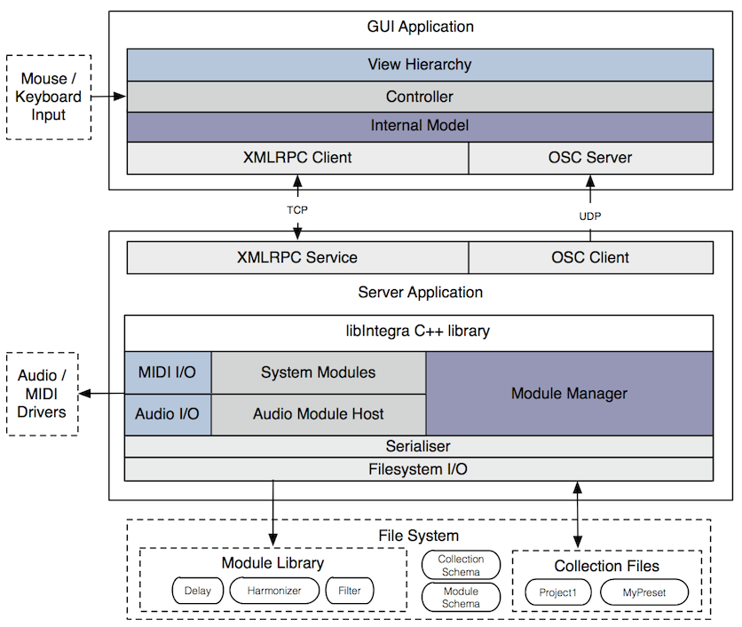

# Integra Live software architecture

## Overview

Integra Live is a graphical application for interactive audio processing.

It consists of the following components:

- **Module library**: a library of software components for live audio processing, analysis, synthesis and control
- **Server**: a command line application that exposes an XMLRPC interface for loading, saving and managing modules and module state 
- **GUI**: a graphical interface that provides a structured workflow for loading and managing modules on the server

These can be summarised by the following diagram:

