## Integra Live Help

### Introduction
Integra Live is divided into two main views: the Arrange View is for composing and experimenting with musical ideas — the Live View is for performance.

To switch between the views, click the buttons in the top-left of the Integra Live window:

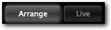

Integra Live also has an Info View showing info about the application and current project.

### Arrange View
The Arrange View is the main view of the application. It enables audio processing *blocks* to be be created and arranged on a musical timeline. It also enables interactive elements to be added through the Routing and Scripting tabs in the Properties Panel.

#### Blocks
A *block* is a container for adding and connecting *modules*. *blocks* are used to organise *modules* into groupings that make musical sense. One example is the “SpectralDelay” *block* included in the Integra Live Block Library. This *block* contains a stereo soundfile player feeding into two filters and two spectral delays.

- To add a *block* from the Block Library, click the *block* name and drag it onto a *track*

  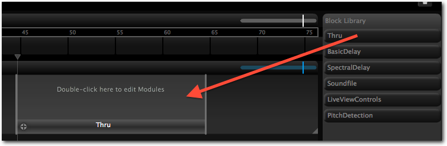

- To add a new empty *block*, double-click an empty area inside a *track*

- To activate a *block*, drag the playhead so that it is horizontally aligned with the *block*

- *blocks* can be re-sized by click-dragging their left or right edge

  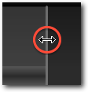

#### Tracks
*tracks* enable multiple *blocks* to be active at the same time.

- To add a *track*, double-click in the empty space under an existing *track*

- To vertically re-size a *track* click-drag the tab in the bottom-right corner

#### Properties Panel
The lower part of Arrange View shows a Properties Panel. This panel changes context depending on whether a *block*, *track* or entire *project* is selected. The Properties Panel is used to control routing, scripting and envelopes. The current *project*, *track* or *block* can also be selected using the "cookie crumb navigation" widget in the top-left of the Properties Panel.

**Figure 2. Block, Track and Project properties selection in Arrange View**

  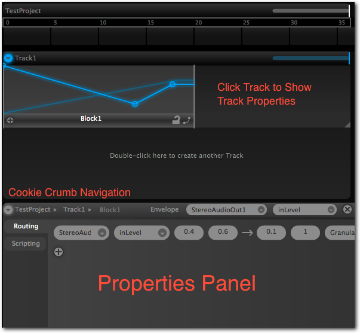

#### Modules

The Module View is a sub-view of the Arrange View. It can be entered by double-clicking on a block.

A *module* can be used to process, generate or analyse musical sound in Integra Live. *modules* can be very simple “effects” such as delays and pitch shifters, or more sophisticated processing tools such as granular synthesisers.

##### Adding and connecting Modules

- To enter Module View double-click a *block* in Arrange View.

- To add a *module* to the Module View drag a module name from the Module Library to the canvas

  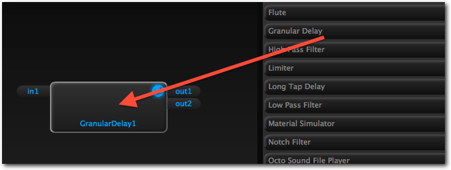

- To connect two *modules*, click and drag from a *module* output (e.g. “out1”) to a *module* input (e.g. “in1”)

  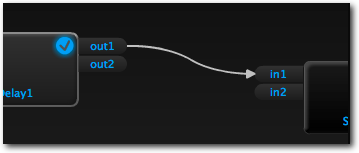

- Dragging a *module* onto an existing connection, will split the connection and add the *module* in the signal path

- Modules and connections can be removed by selecting and then pressing “backspace”

##### Module Properties Panel

- Selecting a Module will cause its controls to be shown in the Module Properties Panel underneath the canvas

**Figure 1. Module Properties Panel showing controls for the Granular Delay module**

  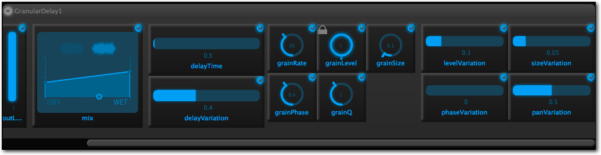

- Module controls (such as sliders and dials) are used to change *module* parameters in real-time and are interactive through clicking, dragging and text-entry

- Precise values can be entered by double-clicking the control‘s numeric value and typing the new value in the text-entry box

  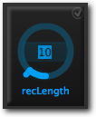
  
- MIDI learn can be enabled for a parameter by clicking the MIDI learn icon on the parameter's control . Once incoming MIDI has been received, an automatic route will be created in the *block*'s routing panel.

#### Routing
In Integra Live, *tracks*, *blocks* and *modules* all have parameters that are used to store values representing their current settings. These values can be routed so that when a source parameter changes, the value of any target parameters also changes. This can be used to route the value of a slider on an external controller to “room size” of a reverb, or to route the value of a “play” button to another “play” button so that playback of two separate modules starts simultaneously.

- To add routing within a *block*, select a *block*, then click the Routing Tab in the Block Properties Panel, then click the “+” icon to add a new route

- The drop-down menus can then be used to set the source *module*, source parameter, target *module* and target parameter

  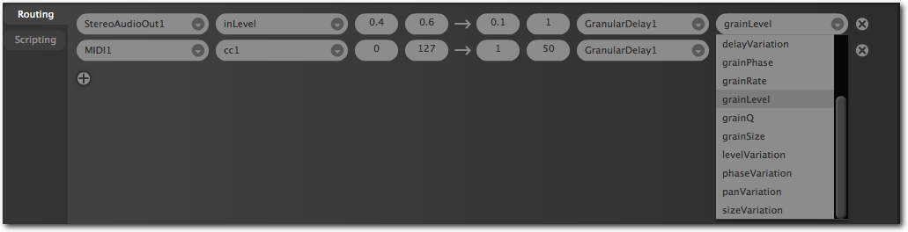

- The same process can also be used for routing between *blocks* or *tracks*, by selecting the parent *track* or *project* respectively

When a route is created between two parameters, the target parameter becomes “locked”. A small lock icon will be displayed on the parameter's control in the module properties panel indicating that it cannot be changed. To temporarily override the lock, hover over the control and hold the `ctrl` key.

#### Scripting
Integra Live has a built-in scripting facility based on the [Lua programming language](http://www.lua.org). Scripts can be used to set and get parameters and perform a range of procedural operations on them.

- To add scripting within a *block*, select a *block*, then click the Scripting Tab in the properties panel, then click the “+” icon to add a new script. Script can then be typed into the text-area

- Integra Script is a super-set of Lua, with the added ability to directly address Integra Live parameters using “dot notation”

        x = AudioIn1.vu
        TapDelay1.delayTime = math.abs(x) / 10.

- Scripts can be triggered by routing any parameter to the Script “trigger” parameter

#### Timeline
The master timeline provides a reference point against which musical ideas can be organised. Timeline progression can be linear, where the ordering and duration of blocks corresponds to their ordering in performance, or non-linear, where the playhead moves to arbitrary points on the timeline with some blocks being activated indefinitely or stopped and started through user interaction.

- The playhead position can be changed manually by click-dragging the control triangle

  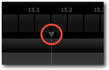

- The playhead state can be set to “play” or “pause” using the button controls in the top-left of the Arrange View

- Clicking the timeline numbering, can be used to zoom and scroll the view. Clicking and dragging left/right controls horizontal scroll, dragging up/down controls zoom level

#### Scenes
Scenes are used to create user-defined progressions through musical time. One application of this is to define Scenes that correspond to different sections of a musical work “Section A”, “Section B”, “Cadenza” etc. Another application is to create multiple pathways within a work as found in improvisation and “open form” composition

- Scenes can be added by click-dragging in the *scene bar* on the global timeline

  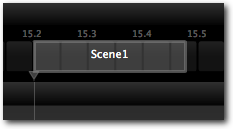

- When a scene is selected, its properties are shown in the Properties Panel

- A scene can be activated by selecting it in the *global timeline*,
    or by selecting its keybinding in Live View

- A scene can have three different states when it is activated:

    **Hold:**The playhead will be set to pause when the scene becomes
    active

    **Play:**The playhead will be set to play when the scene becomes
    active

    **Loop:**The playhead will loop back to the beginning of the scene,
    when it reaches the scene end

#### Envelopes
Envelopes can be used to automate the control of module parameters. This can be used for creating pre-defined musical gestures resulting from multiple module parameters changing simultaneously. Another example use is to create cross-fades between sections.

- To add an envelope select a module from the modules dropdown on the Block Properties Panel:

  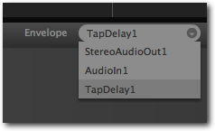

- Select the parameter to control from the parameters dropdown:

  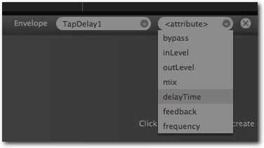

- To add control points click on the envelope line in the block:

  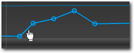

- To delete a control point, drag it to the left until it disappears and release the mouse button.

- To select an envelope use the *module* and parameter dropdowns on the Block Properties Panel.

- To delete an envelope click the “x” next to the *module parameter* dropdown on the Block Properties Panel.

As with routing, when an envelope is created, the target parameter becomes “locked”. A small lock icon will be displayed on the parameter's control in the module properties panel indicating that it is being controlled by an envelope cannot be changed. To temporarily override the lock, hover over the control and hold the `ctrl` key.

#### Block Toolbar
Each block has a *block toolbar*, which contains a number of buttons that can be used to perform actions on the block.

- To enter the Module View for a given *block*, click the plus sign: 
- To lock a given envelope for editing click the lock button. When the lock is closed:  only the current envelope will be selectable. When the lock is open:  any envelope can be selected by clicking on it.
- To modify the curvature of an envelope, click the curve button. When the curve has arrow indicators  , envelope curvature can be modified by clicking an envelope and dragging up or down to change the shape of the curve.

### Live View
The Live View is designed for live performance. Its purpose is to provide a reduced set of module controls for each Block, with custom control sizes and layout for convenience. When in Live View the computer keyboard also becomes active for navigating between Scenes.

- Controls can be added to Live View by selecting Arrange View, clicking “+” on the relevant block, and then clicking the checkbox in the top right corner of the required controls

- An entire Module‘s controls can be added or removed from the Live View using the checkbox on each module

- Controls can also be added directly in Live View by right-clicking the canvas and selecting a control from the menu:

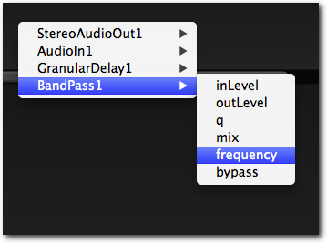

**Figure 3. Live View with custom control layout and keyboard map**

  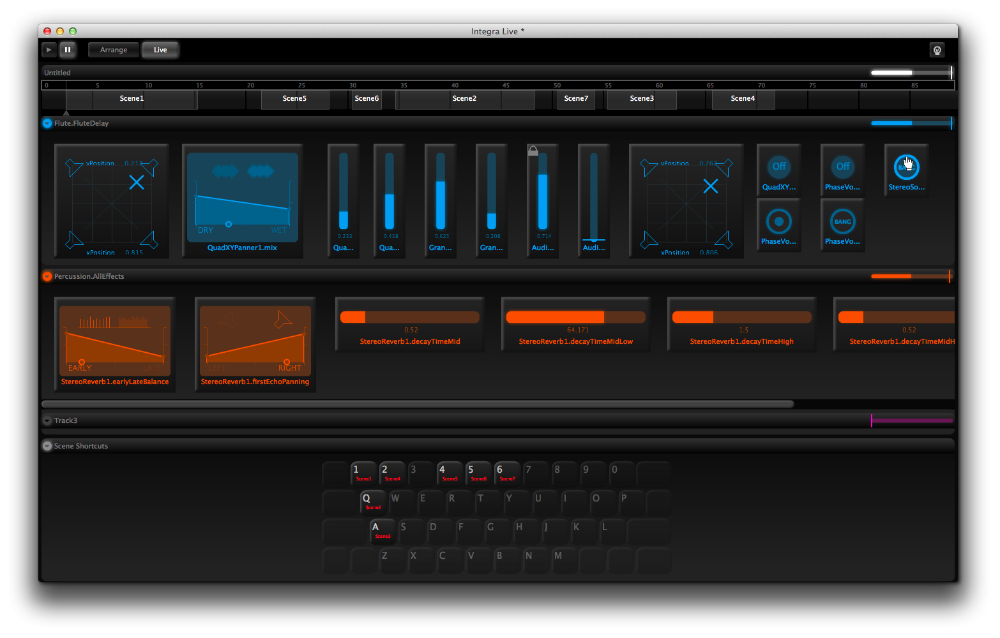

#### Scene shortcuts

- Scenes can be activated from Live View by pressing the key associated with each scene

- Scene key bindings can be reassigned by click-dragging the scene names on the Live View keyboard map

#### Control layout

- Controls in Live View can be moved and re-sized by click-dragging their background and edges respectively

### Info View

The Info View shows information about elements in Integra Live when the cursor hovers over them.

The Info View can be shown or hidden at any time using the View menu

#### Adding Info

The Info View can be used to add info to projects. Info can be added to the project itself, as well as individual *tracks*, *blocks* and *scenes*.

To add info to an element:

- Hover the mouse over the element
- Press **Control-3** (**F2 on Windows**) to lock the Info View
- Click the “edit” button on the Info View title bar
- Type your info into the Info panel
- Press **Control-3** (**F2 on Windows**) to release the Info View

Info can now be viewed by hovering over the element with the cursor.

### Module Management

/** to be written **/

### Other features

#### Mute Control

/** to be written **/

#### MIDI Monitor

/** to be written **/

#### Lighting

- Lighting can be set to “on” for studio use and “off” for live use in darkened environments. This is achieved by clicking the *lighting icon* in the top-right of the application window 

#### Import and export

*Tracks*, *blocks* and *module settings* can all be exported and imported to/from disk. This enables specific components to be moved between projects. Additionally, *blocks*, can be added to the Block Library, which allows easy drag ‘n’ drop of exported *blocks*.

- Import/export is available from the context menu in Arrange View. For example to export a track, context-click the track and click “Export...-\>Track”

  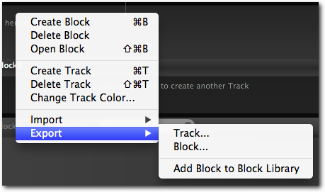

#### Renaming

- *Tracks*, *blocks* and *modules* can be renamed by double-clicking their name and typing in the text-entry box

### Further support
This guide is not intended to be exhaustive. For additional questions, feature requests or bug reports, please use the [online feedback forum](http://integralive.org/forum).

<link rel="stylesheet" type="text/css" href="../../page-images/style.css" media="screen" />
