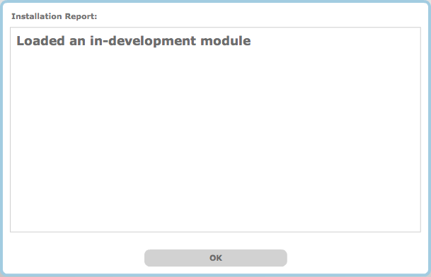

## Integra Module Development Quick Start
<!-- This is a tutorial -->

This is a step-by-step tutorial showing how to create a simple [Tremolo](http://en.wikipedia.org/wiki/Tremolo) module for [Integra Live](http://integralive.org). 

Since Integra modules are written in Pd, a basic knowledge of [Pure Data](http://puredata.info) is required. Developers unfamiliar with Pd should [start here](http://puredata.info/docs/StartHere/).

### Requirements

This tutorial requires the Integra Module Creator application.

**OS X:** [download the Module Creator.dmg](http://sourceforge.net/projects/integralive/files/), mount the DMG, and drag the “Module Creator.app” to the Applications folder.

**Windows:** the Module Creator is bundled with the main Integra Live installer. To install, [download the Integra Live.msi](http://sourceforge.net/projects/integralive/files/), double-click the .msi file and follow the on-screen instructions. Once installed, the Module Creator will be available from via the Start Menu.

### Creating a Module

1. Open the Module Creator
2. Click **File -> Import Template... -> Processors -> Processor.integra-module** to load the Processor template

 

3. Select the Interface Info tab in the Module Creator and enter the details as below

 

4. Select the Endpoints tab in the Module Creator and click the Add Endpoint button

5. Enter the details for a “depth” *endpoint* as shown below

  

6. Click the Add Endpoint button and enter the details for a “rate” *endpoint* as shown below

  

7. Click the Widget Layout tab and layout the widgets as shown below

  

8. Click Edit In Pd and open the `mono_processor` subpatch inside the `MonoProcessor` abstraction

9. Open the `module_implementation` subpatch and add the implementation as shown below

  

10. Save the `MonoProcessor.pd` patch and exit Pure Data. 

11. Now, test the module by selecting Test In Integra Live from the Test menu in the Module Creator. Integra Live will open, with a confirmation that the module has been installed

  

12. Click OK and double-click `Block1` to open it. The new module will now be displayed in red in the Module Library

  

13. To test the Tremolo module drag it into the Module View and connect it up as shown below

  

14. Finally quit Integra Live and select Save As... from the File menu in the Module Creator to save the module

15. The module can now be installed in Integra Live by double-clicking the module file, or by selecting Install 3rd Party Modules... from the File menu in Integra Live

### More Information

For more information about creating Integra modules, see the Integra Module Development Guide

### Further support

If you have any further questions, feature requests or bug reports, please use our [online forum](http://integralive.org/forum).

<link rel="stylesheet" type="text/css" href="../../page-images/style.css" media="screen" />

