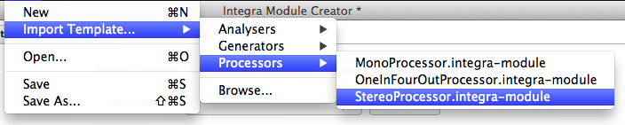
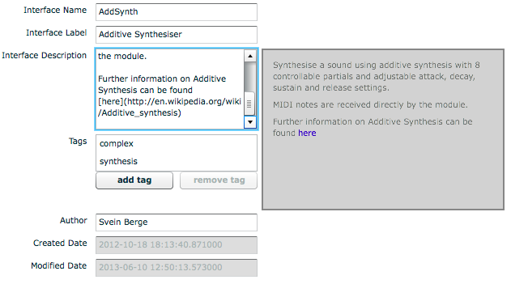
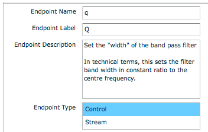
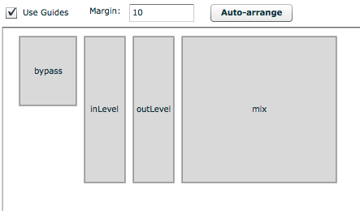

## Integra Module Development

This tutorial will explain how to create modules that can be used in the [Integra Live](http://integralive.org) software. 

### Requirements

In order to create Integra modules, the Integra Module Creator tool is required.

On Mac OS X, [download the Module Creator.dmg](http://sourceforge.net/projects/integralive/files/), mount the DMG, and drag the “Module Creator.app” to the Applications folder.

On Windows, the Module Creator is bundled with the main Integra Live installer. To install, [download the Integra Live.msi](http://sourceforge.net/projects/integralive/files/), double-click the .msi file and follow the on-screen instructions. Once installed, the Module Creator will be available from via the Start Menu.

### Anatomy of a Module

Integra modules consist of two stored components: *interface* and *implementation*. A module's *interface* defines all of the **external** characteristics of the module such as its name, description, tags, endpoints, widgets and widget layout. A module's *implementation* defines the **internal** audio and control processing algorithms. 

The *interface* is defined using the Integra Module Creator tool, and written to a file, which is read by Integra Live to discover information about the module. The information included in the *interface definition* allows Integra Live to determine such things as which modules are included in the module library and what to show in the Info panel.

The *implementation* is defined using the [Pure Data patching environment](http://puredata.info), and loaded in Pure Data on request when Integra Live is running.

#### Module Endpoints

The module *interface* contains a schematic description of one or more *endpoints*. An *endpoint* is a connectable attribute that can be of type Control or Stream. Control *endpoints* define parameters such as “delay time” or “frequency”. Stream *endpoints* define audio inputs and outputs. The information included in the *endpoint* definitions allows Integra Live to determine such things as which parameters to show in the routing view menus and which control widgets to show in the Module Properties panel. 

Control *endpoints* can of type State or Bang. State *endpoints* are associated with a value that represents the current state of a parameter. This value changes in response to live interaction, internal timers and control processing or as a result of two or more *endpoints* being connected. Endpoint state is saved by Integra Live when *projects* are saved, or *tracks*, *blocks* or *modules* are exported and is restored when they are loaded.

Control *endpoints* of type Bang are stateless and send an “empty” value to any connected *endpoints* when triggered via a GUI widget or by receiving a value from a connected endpoint.   

### Creating a new Module Interface

> We encourage module developers to consider carefully their module's *interface* before creating the module *implementation*. 

Developers should normally develop their *interface* first, later [refactoring](http://en.wikipedia.org/wiki/Refactoring) it after they have created their *implementation* in Pure Data.

#### Import Template...

The Module Creator comes with a selection of templates covering the most common types of module. Templates can be imported via **File > Import Template...**. 

> We encourage module developers to start from an existing template rather than starting from scratch

Templates provide a base-level interface for performing audio input and / or output and endpoints for “active”, “bypass”, “mix”, “inLevel”, “outLevel” and “mute” where appropriate. Most of the modules in the Integra Live Module Library are based on one of these templates.

#### Interface Info

When the Module Creator is first opened, the Interface Info tab is active. Interface Info has one compulsory field (Interface Name), and a number of optional fields. Hovering over each field with cursor will show a tooltip explanation for each field.

**Interface Name** must be in [upper camel case](http://en.wikipedia.org/wiki/Camel_case) without numbers or special characters. The Interface Name will be used to auto-generate module *instance* names in Integra Live, which are used in the Routing and Scripting panels. 

> We encourage module developers to use a short easily identifiable Interface Name
 
The naming conventions for modules is as follows:

- Stereo* — the module has exactly two outputs and zero or more inputs OR exactly two inputs and zero or more outputs
- Quad* — the module has exactly four outputs and zero or more inputs OR exactly four inputs and zero or more outputs
- Octo* — the module has exactly eight outputs and zero or more inputs OR exactly eight inputs and zero or more outputs

No special prefix is used for all other input / output configurations. For example a bandpass filter with one input and one output would simply be called BandPass or BandPassFilter. 
 
**Interface Label** should contain a short human-readable version of the Interface Name. Interface Labels are used construct the *module library* and module *info view* panels in Integra Live.

**Interface Description** should describe what the module does in simple language. Technical terminology should be kept to a minimum. The Interface Description field can be written in [Markdown](http://daringfireball.net/projects/markdown/syntax), with a preview  shown to the right of the text entry panel. The contents of this field are used to generate the *module info* panel contents in Integra Live.

> We encourage module developers to consult the [documentation guidelines](https://github.com/BirminghamConservatoire/IntegraLive/wiki/Contributing-Documentation#module-documentation-guidelines) for further details

A completed Interface Info definition is shown below along with a preview of the Interface Description field.

**Tags** should define a set of tags that can be used to categorise the module. These are used to construct the Tags filter box in the Module List in Integra Live.

A number of pre-defined tags are provided in the module creator. To use your own non-listed tag, click “add tag” and type directly at the cursor.

#### Endpoints

Clicking the Endpoints tab in the Module Creator allows interface info for one or more endpoints to be added. To add an endpoint, click the Add Endpoint button

As Endpoints are added, they are shown in an accordian-style view, where each Endpoint can be revealed by clicking its title bar. Endpoints can be removed, moved or sorted using the button panel on the right.

Each Endpoint has one compulsory field (Endpoint Name), and a number of optional fields. Hovering over each field with cursor will show a tooltip explanation for that field.

**Endpoint Name** must be in [lower camel case](http://en.wikipedia.org/wiki/Camel_case) without special characters. This will be used to auto-generate module parameter names in Integra Live, which are used in the Routing and Scripting panels as well as for *control* labels in the Module Properties and Live views.

> We encourage module developers to use a short easily identifiable Endpoint Name 

**Endpoint Label** should contain a short human-readable version of the Endpoint Name. Endpoint Labels are used construct the Info  panels for module parameters in Integra Live.

**Endpoint Description** should describe what the module does in simple language. Technical terminology should be kept to a minimum. The Endpoint Description field can be written in [Markdown](http://daringfireball.net/projects/markdown/syntax), with a preview  shown to the right of the text entry panel. The contents of this field are used to generate the *parameter info* panel contents in Integra Live.

> We encourage module developers to consult the [documentation guidelines](https://github.com/BirminghamConservatoire/IntegraLive/wiki/Contributing-Documentation#module-documentation-guidelines) for further details

A completed Endpoint Info definition is shown below.

**Endpoint Type** determines whether the Endpoint is a Control parameter such as “delay time” or “frequency” or a Stream such as a module audio input or output. If Stream is selected, then the Stream Direction must be specified as Input or Output in the Stream Info box. If Control is selected then many other options are available as explained below.

**Widget** is used to optionally define a Widget that is assigned to a Control endpoint. Each Endpoint may only have one widget, however, one widget can be assigned to multiple endpoints. For example an XYScratchPad widget has an “x” and “y” axis, and these axes can be assigned to different endpoints such as “pitch” and ”position”. In order to associate a single widget with multiple endpoints the Label field must be completed, and assigned the same value for each endpoint. Following the previous example, the Label “scrubWidget” could be given to the XYScratchPad “x” assigned to “position” and also to the XYScratchPad “y” assigned to “pitch”.

**Control Info** is used to define a more detailed definition of Control Endpoints. 

**Control Type** can either be State or Bang. Bang should be selected for endpoints that correspond to trigger parameters such as “play” or “stop”.  State should be selected for parameters that have a value associated with them such as “delayTime” or “frequency”. If State is selected then the State Info box will be displayed.

**State Info ⇒ State Type** is used to define the type of value that can be stored by the endpoint. Types supported by Integra are Float (32-bit), Integer (32-bit) and String.

**State Info ⇒ Constraint** is a compulsory field for State Control Endpoints, and is used to define a constraint that is applied to the endpoint. This can be a range, or a set of allowed values, both of which restrict the possible values that can be assigned to the endpoint. Endpoint Constraints are used by Integra Live to determine the visual appearance and behaviour of Control Widgets.

**Range** is a compulsory field for State Control Endpoints where the Range state is defined in State Info ⇒ Constraint.

**Range ⇒ Minimum Value / Maximum Value** are used to constrain the bounds of State Control Endpoints of type Integer or Float. For example, a low-pass filter module might have a “frequency” endpoint with Range ⇒ Minimum Value of 20 and a Range ⇒ Maximum Value of 18000 (measured in Hz). 

**Range ⇒ Minimum Length / Maximum Length** are used to constrain the bounds of State Control Endpoints of type String. For example, a sound file player module might have a “path” endpoint with a Range ⇒ Minimum Length of 1 and a Range ⇒ Maximum Length of 1024.

**Allowed Values** are used to constrain the possible values an Endpoint can to take to a specific set of integer, floating point values or strings. For example a "window size" endpoint could have Allowed Values of 64, 128, 256, 512, 1024 and 2048.

**Default Value** is a compulsory field that defines the initial value an Endpoint is set to when a *module* is first instantiated. The Default Value must conform to any Endpoint Constraints.

**State Labels** are optional and defines a set of Value/Label pairs. These can be used to label values at certain points on a Control Widget's range. For example for a “pan” Endpoint, a Value of “-1” could be labelled “left”, “0” — “centre” and “1” — “right”.

#### Widget Layout

Clicking the Widget Layout tab in the Module Creator allows Widgets for Endpoints to be resized and arranged graphically. This will determine the layout of Control Widgets in Integra Live's Module Properties panel. 

#### Implementation

Clicking the Implementation tab in the Module Creator allows the module implementation to be added or edited using a dummy host in Pure Data (Pd). 

### Editing the Pd Patch

> Range checking and constraints are enforced by libIntegra using Constraints specified in the Interface Definition, adding such constraints to the Pd implementation of the module is therefore strongly discouraged

#### Sending Values to libIntegra

#### Saving Files

### Advanced Controls

