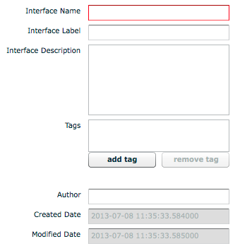
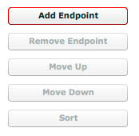
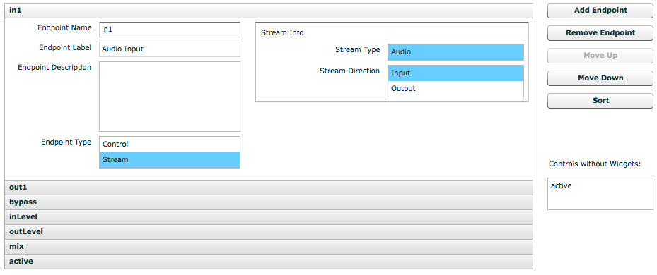
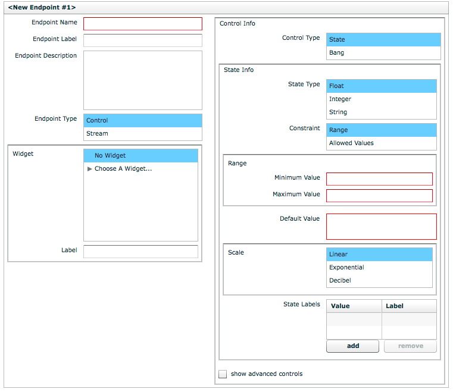
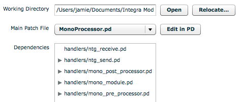
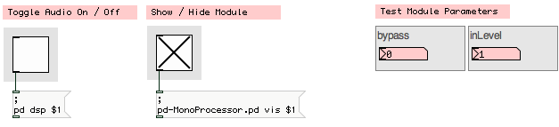
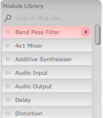

## Integra Module Development Guide

This guide will explain how to create modules that can be used in [Integra Live](http://integralive.org). 

### Requirements

In order to create Integra modules, the Integra Module Creator tool is required.

On Mac OS X, [download the Module Creator.dmg](http://sourceforge.net/projects/integralive/files/), mount the DMG, and drag the “Module Creator.app” to the Applications folder.

On Windows, the Module Creator is bundled with the main Integra Live installer. To install, [download the Integra Live.msi](http://sourceforge.net/projects/integralive/files/), double-click the .msi file and follow the on-screen instructions. Once installed, the Module Creator will be available from via the Start Menu.

### Anatomy of a Module

Integra modules consist of two stored components: *interface* and *implementation*. A module's *interface* defines all of the **external** characteristics of the module such as its name, description, tags, endpoints, widgets and widget layout. A module's *implementation* defines the **internal** audio and control processing algorithms. 

The *interface* is defined using the Integra Module Creator tool, and written to a file. This file, called an Integra Interface Definition (IID) is a type of [XML](http://en.wikipedia.org/wiki/Xml) file, which is read by Integra Live to discover information about the module at runtime. The information included in the IID enables Integra Live to determine such things as which modules are included in the module library and what to show in the module's Info panel.

The *implementation* for the module is defined using the [Pure Data patching environment](http://puredata.info) (Pd), and saved as a set of Pd patches. These patches are loaded in Pure Data on request when Integra Live is running. 

When a module is saved by the Module Creator, the *interface* (IID file) and *implementation* (Pd patches) are bundled up together in a <a href="http://en.wikipedia.org/wiki/ZIP_(file_format)">ZIP</a> archive with the suffix `.integra-module`.

#### Module Endpoints

The module *interface* contains a schematic description of one or more *endpoints*. An *endpoint* is a connectable attribute that can be of type Control or Stream. Control *endpoints* define parameters such as “delay time” or “frequency”. Stream *endpoints* define audio inputs and outputs. The information included in the *endpoint* definitions enables Integra Live to determine such things as which parameters to show in the routing view menus and which control widgets to show in the Module Properties panel. 

Control *endpoints* can of type State or Bang. State *endpoints* are associated with a value that represents the current state of a parameter. This value changes in response to live interaction, internal timers and control processing or as a result of two or more *endpoints* being connected. Endpoint state is saved by Integra Live when *projects* are saved, or *tracks*, *blocks* or *modules* are exported and is restored when they are loaded.

Control *endpoints* of type Bang are stateless and send an “empty” value to any connected *endpoints* when triggered via a GUI widget or by receiving a value from a connected endpoint.   

### Creating a new Module Interface

> We encourage module developers to consider carefully their module's *interface* before creating the module *implementation*. 

Developers should normally develop their *interface* first, later [refactoring](http://en.wikipedia.org/wiki/Refactoring) it after they have created their *implementation* in Pure Data.

#### Import Template...

The Module Creator comes with a selection of templates covering the most common types of module. Templates can be imported via **File > Import Template...**. 


> We encourage module developers to start from an existing template rather than starting from scratch

Templates provide a base-level interface for performing audio input and / or output and endpoints for “active”, “bypass”, “mix”, “inLevel”, “outLevel” and “mute” where appropriate. Most of the modules in the Integra Live Module Library are based on one of these templates.

> In addition to the Templates provided with the Module Creator, developers can import any other module as a Template by selecting Import Template -> Browse...

#### Interface Info

When the Module Creator is first opened, the Interface Info tab is active. Interface Info has one compulsory field (Interface Name), and a number of optional fields. Hovering over each field with cursor will show a tooltip explanation for each field.



**Interface Name** must be in [upper camel case](http://en.wikipedia.org/wiki/Camel_case) without numbers or special characters. The Interface Name will be used to auto-generate module *instance* names in Integra Live, which are used in the Routing and Scripting panels. 

> We encourage module developers to use a short easily identifiable Interface Name
 
The naming conventions for modules is as follows:

- Stereo* — the module has exactly two outputs and zero or more inputs OR exactly two inputs and zero or more outputs
- Quad* — the module has exactly four outputs and zero or more inputs OR exactly four inputs and zero or more outputs
- Octo* — the module has exactly eight outputs and zero or more inputs OR exactly eight inputs and zero or more outputs

No special prefix is used for all other input / output configurations. For example a bandpass filter with one input and one output would simply be called BandPass or BandPassFilter. 
 
**Interface Label** should contain a short human-readable version of the Interface Name. Interface Labels are used construct the *module library* and module *info view* panels in Integra Live.

**Interface Description** should describe what the module does in simple language. Technical terminology should be kept to a minimum. The Interface Description field can be written in [Markdown](http://daringfireball.net/projects/markdown/syntax), with a preview  shown to the right of the text entry panel. The contents of this field are used to generate the *module info* panel contents in Integra Live.

> We encourage module developers to consult the [documentation guidelines](https://github.com/BirminghamConservatoire/IntegraLive/wiki/Contributing-Documentation#module-documentation-guidelines) for further details

A completed Interface Info definition is shown below along with a preview of the Interface Description field.


**Tags** should define a set of tags that can be used to categorise the module. These are used to construct the Tags filter box in the Module List in Integra Live.

A number of pre-defined tags are provided in the module creator. To use non-listed tags, click “add tag” and type directly at the cursor.

#### Endpoints

Clicking the Endpoints tab in the Module Creator enables interface info for one or more endpoints to be added. To add an endpoint, click the Add Endpoint button



As Endpoints are added, they are shown in an accordian-style view, where each Endpoint can be revealed by clicking its title bar. Endpoints can be removed, moved or sorted using the button panel on the right.



Each Endpoint has one compulsory field (Endpoint Name), and a number of optional fields. Hovering over each field with cursor will show a tooltip explanation for that field.



**Endpoint Name** must be in [lower camel case](http://en.wikipedia.org/wiki/Camel_case) without special characters. This will be used to auto-generate module parameter names in Integra Live, which are used in the Routing and Scripting panels as well as for *control* labels in the Module Properties and Live views.

> We encourage module developers to use a short easily identifiable Endpoint Name 

**Endpoint Label** should contain a short human-readable version of the Endpoint Name. Endpoint Labels are used construct the Info  panels for module parameters in Integra Live.

**Endpoint Description** should describe what the module does in simple language. Technical terminology should be kept to a minimum. The Endpoint Description field can be written in [Markdown](http://daringfireball.net/projects/markdown/syntax), with a preview  shown to the right of the text entry panel. The contents of this field are used to generate the *parameter info* panel contents in Integra Live.

> We encourage module developers to consult the [documentation guidelines](https://github.com/BirminghamConservatoire/IntegraLive/wiki/Contributing-Documentation#module-documentation-guidelines) for further details

A completed Endpoint Info definition is shown below.


**Endpoint Type** defines whether the Endpoint is a Control parameter such as “delay time” or “frequency” or a Stream such as a module audio input or output. When Stream is selected, the Stream Direction must be specified as Input or Output in the Stream Info box. When Control is selected then many other options are available as explained below.

**Widget** is used to optionally define a Widget that is assigned to a Control endpoint. Each Endpoint may only have one widget, however, one widget can be assigned to multiple endpoints. For example an XYScratchPad widget has an “x” and “y” axis, and these axes can be assigned to different endpoints such as “pitch” and ”position”. In order to associate a single widget with multiple endpoints the Label field must be completed, and assigned the same value for each endpoint. Following the previous example, the Label “scrubWidget” could be given to the XYScratchPad “x” assigned to “position” and also to the XYScratchPad “y” assigned to “pitch”.

**Control Info** is used to define a more detailed definition of Control Endpoints. 

**Control Type** can either be State or Bang. Bang should be selected for endpoints that correspond to trigger parameters such as “play” or “stop”.  State should be selected for parameters that have a value associated with them such as “delayTime” or “frequency”. When State is selected then the State Info box will be displayed.

**State Info ⇒ State Type** is used to define the type of value that can be stored by the endpoint. Types supported by Integra are Float (32-bit), Integer (32-bit) and String.

**State Info ⇒ Constraint** is a compulsory field for State Control Endpoints, and is used to define a constraint that is applied to the endpoint. This can be a range, or a set of allowed values, both of which restrict the possible values that can be assigned to the endpoint. Endpoint Constraints are used by Integra Live to determine the visual appearance and behaviour of Control Widgets.

**Range** is a compulsory field for State Control Endpoints where the Range state is defined in State Info ⇒ Constraint.

**Range ⇒ Minimum Value / Maximum Value** are used to constrain the bounds of State Control Endpoints of type Integer or Float. For example, a low-pass filter module might have a “frequency” endpoint with Range ⇒ Minimum Value of 20 and a Range ⇒ Maximum Value of 18000 (measured in Hz). 

**Range ⇒ Minimum Length / Maximum Length** are used to constrain the bounds of State Control Endpoints of type String. For example, a sound file player module might have a “path” endpoint with a Range ⇒ Minimum Length of 1 and a Range ⇒ Maximum Length of 1024.

**Allowed Values** are used to constrain the possible values an Endpoint can to take to a specific set of integer, floating point values or strings. For example a "window size" endpoint could have Allowed Values of 64, 128, 256, 512, 1024 and 2048.

**Default Value** is a compulsory field that defines the initial value an Endpoint is set to when a *module* is first instantiated. The Default Value must conform to any Endpoint Constraints.

**State Labels** are optional and defines a set of Value/Label pairs. These can be used to label values at certain points on a Control Widget's range. For example for a “pan” Endpoint, a Value of “-1” could be labelled “left”, “0” — “centre” and “1” — “right”.

#### Widget Layout

Clicking the Widget Layout tab in the Module Creator enables Widgets for Endpoints to be resized and arranged graphically. This will determine the layout of Control Widgets in Integra Live's Module Properties panel. 


#### Implementation

Clicking the Implementation tab in the Module Creator enables the module implementation to be added or edited using Pure Data (Pd). 



The module implementation's files will be unpacked into a temporary working directory (`~/Documents/Integra Module Creator` on Mac). This can be relocated by clicking the Relocate... button.

Missing Pd ‘objects’ (externals or abstractions) will be listed in a Missing Objects box, and unused files listed in an Unused Files box. 

> Developers are encouraged to delete all Unused Files before saving unless they are explicitly required (e.g. in the case of a README or data file)

### Editing the Pd Patch

The Pd patch for module *implementations* can be edited by clicking the Edit In Pd button in the Implementation tab of the Module Creator. This will open up a Pd window some controls for module *endpoints* under the heading Test Module Parameters.

The patch that opens when Edit In Pd is clicked is a **host** patch. To open a module implementation, click the toggle under Show / Hide Module. This will open the top-level Pd patch for the module.



The module is required to provide audio inlets and outlets for each Audio Stream Endpoint, and to respond to messages from libIntegra using the receive symbol `integra-broadcast-receive`. Followed by a `[route $1]` to route only messages designated for this instance. When using one of the Templates included with the Module Creator, this boilerplate is provided by the `[handlers/ntg_receive]` abstraction.

> Developers are strongly encouraged to use one of the provided templates rather than starting their module from scratch

The `[handlers/ntg_receive]` abstraction provides three outlets:

- The right-most outlet passes messages with selectors corresponding to Endpoint names, and values corresponding to Endpoint values, e.g. ‘frequency 300’, ‘delayTime 1.2’
- The centre outlet passes a ‘fini’ `bang` directly before the object is deleted
- The left-most outlet passes a ‘init’ `bang` immediately after the object is added to the canvas

The messages from the outlet should be handled by a `[route]` object, e.g. `[route frequency delayTime]` to pass control messages into the DSP. The ‘init‘ and ‘fini’ `bang` messages should be used for any initialisation or cleanup that needs to be done on the patch.

The actual implementation of the module's functionality should be as minimal as feasibly possible. 

> Developers should not add range checking and checks for legal values to their modules as these are enforced by libIntegra using Constraints specified in the Interface Definition

> Developers are discouraged from adding high-level documentation in the comments of their Pd patch especially when it duplicates aspects of the *interface definition*

#### Sending Values to libIntegra

Sometimes a module implementation will need to send values back to libIntegra, for example so that the current value of a VU meter can be displayed, or so that the state of a “playPosition” endpoint can be updated. In order to send values back to libIntegra, messages must be sent to the `integra` receive symbol using `[s integra]`. The message format for sending these values is:

```
<source module id> <endpoint name> scalar <value>
```

e.g.

```
21 vu1 scalar -32
```

If using one of the implementation Templates provided with  the Module Creator, it is sufficient to simply pass `<endpoint name> <value>` pairs to the `[handlers/ntg_send $1]` abstraction instance.

Values sent to libIntegra will be posted to the Pd console for debugging purposes.

> Developers are encouraged to use one of the provided templates rather than starting their module from scratch

### Saving Files

If the module implementation loads files, and this file loading is exposed to the user, the module is responsible for persisting these files. For example, if a soundfile player supports a ‘openFile’ String Endpoint, which gets passed a string representing a path to a soundfile by a SoundFileLoadDialog Widget, then the implementation must ensure the loaded file is available next time the module instance is loaded.

In order to achieve this the module implementation must do three things:

1. The special endpoint “dataDirectory” must be included in the Interface Definition. It must be defined as a Control endpoint with Control Type: State; State Type: String; and Range: 0...1024. Can Be Source and Can Be Target must also be unchecked under “show advanced controls” in the bottom right of the “dataDirectory” Endpoint panel under the Endpoints tab.

2. The endpoint used to pass the file path must have Is Input File checked under “show advanced controls”. For example if an *endpoint* named “openFile” is used to store the path, this endpoint must have Is Input File checked

3. The *implementation* must provide the necessary logic to restore the saved file from the *data directory* when the module instance is created

#### Saving Files from Pd

If a “dataDirectory” endpoint has been correctly defined in the Interface Definition of a module, libIntegra will set the value of this endpoint to the path to a temporary directory at runtime.

This *data directory* should be used by the module implementation for saving files.

> Developers should only use the provided *data directory* for saving files used by the module. No other location should be used as this will result in data not being included in Integra Project files.

When a Project is saved (or a Track, Block or Module) is exported in Integra Live, libIntegra bundles up the contents of each module's *data directory* (if there is one), and saves it inside the “.integra” file. When the “.integra” file is next loaded, the data directory gets unpacked to a temporary location and the value of the “dataDirectory” Endpoint for the corresponding module gets set to this location.

Therefore if a module instance saves and audio file to `<dataDirectory>/audio.wav`, the Integra Live Project is saved and then reloaded on a different computer, the module instance can expect to find `audio.wav` in the path its “dataDirectory” Endpoint is set to.

> For a working example of how to implement file save / load for a module developers should inspect the StereoSoundfileTrigger module distributed with Integra Live

**NOTE: the value of a “dataDirectory” Endpoint will not get set by libIntegra in the Pd module host provided by the Module Creator (i.e. when Edit In Pd is clicked) in order to test file saving functionality, the module must be tested in Integra Live**

### Advanced Controls

The Endpoint schema for Integra Interface Definitions has a number of advanced fields, which can be accessed through each Endpoint's panel in the Endpoints tab of the Module Creator.

**Is Saved to File** defines whether the state of the Endpoint is saved to file when a save operation is performed by libIntegra. The default is for Is Saved to File to be checked. However, if the Endpoint is storing transient data that shouldn't be persisted between saves, Is Saved to File should be unchecked. An example would be a “currentPitch” on a pitch detector module where the value of “currentPitch” could be obsolete if a live input is connected to the pitch detector.

**Is Input File** should be checked if the Endpoint is used to pass the path of a file to be loaded by the implementation. When Is Input File is checked, libIntegra creates a temporary *data directory* for the module, copies the file into this directory, and passes the new path of the file inside the *data directory* to the implementation. An example would be an “openFile” endpoint on a soundfile player — usually this would also be assigned a SoundFileDialog Widget.

**Can Be Source / Can Be Target** define whether the Endpoint can be the source and / or target of a connection. Both of these options are checked by default enabling the Endpoint to be connected to other endpoints by libIntegra. Integra Live also uses this field to construct the contents of the dropdown menus in the Routing panel. If Can Be Source is unchecked, the Endpoint will not be  available as a source in the Routing panel, if Can Be Target is unchecked, the Endpoint will not be available as a target. 

### Testing in Integra Live

Modules can be tested in Integra Live without separately loading Integra Live and installing the module. To test a module in Integra Live from the Module Creator, select Test In Integra Live from the Module Creator's Test menu. This will open a copy of Integra Live and temporarily install your module.

The module will then be accessible via the Module Library in Module View (accessible by double-clicking Block1). In-development modules appear at the top of the Module List, highlighted in red. 



Modules can iteratively be tested in Integra Live by making changes in the Module Creator with the embedded version of Integra Live open and repeatedly selecting Test In Integra Live. Note that each time a new in-development module is installed in the running application, the update module must be dragged from the Module Library to the Module View canvas.

### Further support

If you have any further questions, feature requests or bug reports, please use our [online forum](http://integralive.org/forum).


<link rel="stylesheet" type="text/css" href="../../page-images/style.css" media="screen" />

