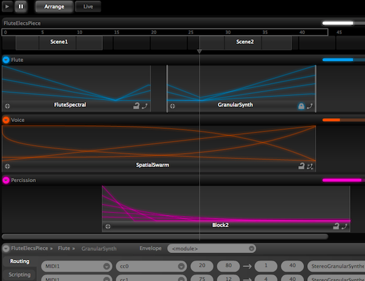
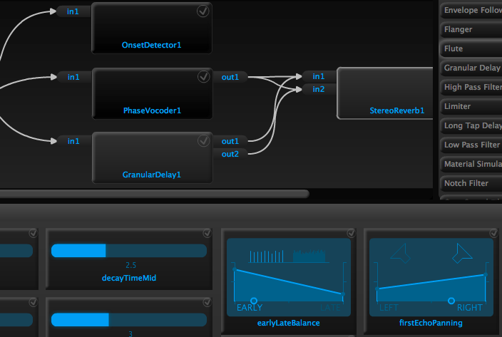
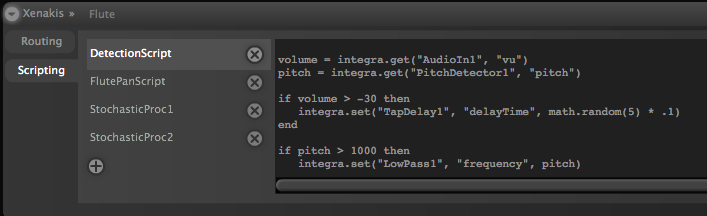
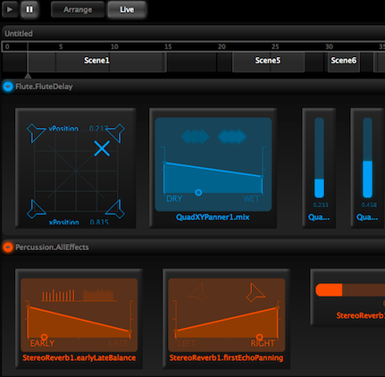

### A Musical Workflow
Integra Live is designed with musicians in mind. We have therefore created an application that is optimised for a process of experimentation, discovery, refinement and performance. The top level of the application provides two views: *arrange* and *live*. The *arrange view* provides a creative space to arrange *blocks* of audio processing, control parameters with live MIDI inputs, create automation envelopes and create *scenes* that define progressions between audio processing setups. 

When you're ready to start creating a performance setup, the *live view* provides a space to group the controls you need in single view. As you change scene, the controls for that scene will slide seamlessly into view.

### Turnkey Audio Processing
You shouldn't need to write code or patch objects to create interesting live processing. Nor should you need to deal with the complexities of finding, loading and learning external plugins. With Integra Live you don't have to. The software provides a library of built-in audio processing modules that offer everything you need to get started with interactive audio. Modules share a common look and feel and layout meaning you can get straight on with the interesting part: connecting modules to make your own blocks and tweaking parameters.

Everything is there for you to hit the ground running and get creative from the outset.

### Connect anything, Script anything
With the Integra Live routing panel, anything can be connected everything else. External MIDI controllers can be routed to module parameters, or parameters can be routed to each other. This allows complex one-to-many mappings and advanced operations such as automatic event triggering through a single simple interface. Parameters have non-linear ranges where you'd expect, allowing for more musical control over details such as filter cutoff and delay times. Scaling is of course fully adjustable.

For those who like to express themselves through text, all module parameters in Integra Live can be scripted through *Integra script* a lightweight superset of the [Lua](http://lua.org) scripting. In just a few lines of simple code a parameter can be set to change randomly or conditionally based on the values of other parameters.

### Turnkey storage
An Integra Live project file contains all the resources you need for your piece. This includes all modules, and any soundfiles you have loaded or recorded. This means that you can share your projects, and no-one needs to worry about missing plugins, externals or resources. It's all there. What's more, we guarantee that your project will always be loadable in future versions of Integra Live, even if modules are changed or removed.

### Open Source stack
Integra Live has been built from the ground up using open source software and open standards. Our audio processing host runs in the [Pure Data](http://puredata.info) engine, communicating with the Integra server via Open Sound Control messaging. The graphical front end is written using the open source [Apache Flex](http://flex.apache.org) framework. Integra Live itself is freely available under the [GNU GPL license](http://en.wikipedia.org/wiki/GNU_General_Public_License) with source code available [on Sourceforge](https://sourceforge.net/projects/integralive).

