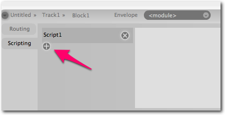
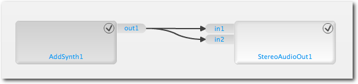
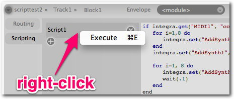
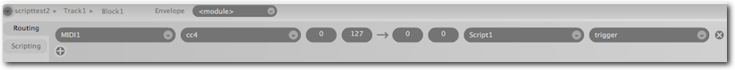

## Integra Scripting
Scripting in Integra Live allows users to perform basic programmatic operations on module attributes such as:

- [condititional evaluation](http://en.wikipedia.org/wiki/Conditional_\(programming\))
- mathematical operations such as [arithmetic](http://en.wikipedia.org/wiki/Arithmetic), [trigonometry](http://en.wikipedia.org/wiki/Arithmetic) and [random number generation](http://en.wikipedia.org/wiki/Random_number_generation)

Integra script is a superset of the [Lua](http://www.lua.org/) programming language.

A good tutorial on the Lua language can be found [here](http://lua-users.org/wiki/LuaTutorial).

### Integra functions

The Integra scripting processor adds the following additional functions to the basic Lua language:

> **Set the value of an attribute**  
> `integra.set("<instance name>", "<attribute>", <value>)`  
> e.g. `integra.set("TapDelay1", "delayTime", 2.23)`

> **Get the value of an attribute**  
> `integra.get("<instance name>", "<attribute>")`  
> e.g. `dt = integra.get("TapDelay1", "delayTime")`

### Adding a script

Scripts can be added, removed and edited through the **properties panel** of *projects*, *tracks* or *blocks* in the Integra Live Arrange view. To add a script:

- Activate the arrange view by clicking the button in the top-right of the screen
- Select the entity you want to add a script to, e.g.'Block1'
- Select the 'Scripting' tab on the left side of the Block properties panel
- Click the '+' button

The script can now be edited by typing in the textarea.

### Hello World!
Our first script is simply going to add a module and play a note. In order to do this, we need to first add an "Additive Synthesiser" module to the *module canvas* inside **Block1**, and connect the **AddSynth1** output to the **StereoAudioOut1**.

To confirm that we have audio, click the **test** button in the **AddSynth1** *properties panel*. If no audio is heard, check your *audio preferences* and try again.

Once we have audio, return to the arrange view:

- select **Block1**
- select the *scripting tab* in the **Block1** *properties panel*
- click the '+' button
- click in the *textarea* to the right of the **Script1** label

You should see a flashing cursor. We are now ready to type our first script. Enter into the *textarea*:

    integra.set("AddSynth1", "test", 1)

### Executing a script

There are several ways to execute a script. The first is to manually execute it:

- right-click (or ctrl-click) on the script's name tab
- select (left-click) 'execute' from the context menu

Another way to execute a script is to send a *value* to its **trigger** attribute via the *routing* tab in the Block *properties panel*. Here we connect MIDI CC 4, which corresponds to a 'touch pad' on an MIDI controller, to the **Script1** **trigger** attribute.

### A simple script
In our next script, we're going to extend our 'Hello World' script, so that it changes the *attributes* of **AddSynth1** whilst the note is sounding.

In order that we can trigger our script via our MIDI controller, we first need to add a conditional expression to the beginning of the script. This will ensure that the Additive synthesiser is only triggered when we get a MIDI value 127, and not when we get any other value (such as zero).

    if integra.get("MIDI1", "cc4") == 127 then
        integra.set("AddSynth1", "test", 1)
    end

This script does two things. It uses the integra.get() function to get the current value of MIDI controller 4, and it then compares the result to the integer value 127, using the Lua logical comparison operator '=='. If the result of this comparison evaluates **true** then our integra.set() function gets called.

We can test this now by tapping our external controller. The result should be the same as when we executed the script via the script context menu. If you don't hear anything, check that you've routed **MIDI1** **cc4** to **Script1** **trigger** in the *Block routing panel*.

Next, we are going to extend the script by adding a *loop*, which gradually adds partials through the duration of a note.

    if integra.get("MIDI1", "cc4") == 127 then
        for i=1,8 do
            integra.set("AddSynth1", "partial" .. i, 0)
        end

        integra.set("AddSynth1", "test", 1)

        for i=1, 8 do
            integra.set("AddSynth1", "partial" ..i, .5)
            wait(.1)
        end
    end

Once you've copied this into the script *textarea*, press the MIDI pad again. You should hear a 1 second harmonic arpeggio.

#### Code breakdown

First we set all partials in **AddSynth1** to zero, using a `for` loop

    for i=1,8 do
        integra.set("AddSynth1", "partial" .. i, 0)
    end

In pseudo-code, this is saying "for each value betwen 1 and 8, set the variable i to the new value and the set the `i`'th partial to 0". Unrolling the loop, we'd get something like:

    integra.set("Addsynth1", "partial1", 0)
    integra.set("Addsynth1", "partial2", 0)
    integra.set("Addsynth1", "partial3", 0)
    etc...

Next we actually play the note, as before:

    integra.set("AddSynth1", "test", 1)

Finally, we use another loop to raise the level of each successive partial to .5 after an interval of 100ms.

    
    for i=1, 8 do
        integra.set("AddSynth1", "partial" ..i, .5)
        wait(.1)
    end

This is almost identical to our first loop, with the key difference being the `wait()` function at the end of the inner block.

`wait()` isn't part of the Lua language, but rather it is an Integra scripting function like `integra.set()` and `integra.get()`. `wait()` causes the script to suspend execution for an interval specified in seconds.

### Introducing 'alea'!

In our final version of the script, we're going to use the Lua `math.random()` function to introduce some randomness. Instead of successively raising the level of each partial when the script is triggered, we're going to successively set eight random partials to eight random amplitudes between zero and one.

    if integra.get("MIDI1", "cc4") == 127 then
        for i=1,8 do
            integra.set("AddSynth1", "partial" .. i, 0)
        end

        integra.set("AddSynth1", "test", 1)

        for i=1, 8 do
            integra.set("AddSynth1", "partial" ..math.random(1,8), math.random())
            wait(.1)
        end
    end

Now, if you hit your MIDI pad, you should here a different combination of partials with each tap.

----

The Integra *project file* for this tutorial can be [downloaded here](http://www.integralive.org/incoming/examples/scripting1.ixd)

<link rel="stylesheet" type="text/css" href="../../page-images/style.css" media="screen" />
