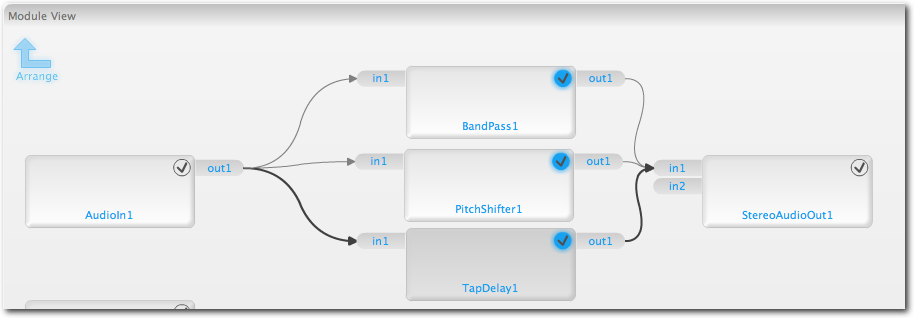

## Integra Scripting
In our second scripting tutorial we will cover a few of the common scripting tasks in Integra Live.

This tutorial assumes you have already read the [Scripting 1 tutorial](../scripting-1).

### Signal path selection

In this example, we have an audio signal, and we would like to route it using scripting. 

There are a number of ways to achieve this, but the most straightforward is to create a fixed network of modules and use the **inLevel** parameter to control signal flow to each module.

So first we need to set up a network of modules to control.

- Start a new project
- Open Block1
- Add the following network

Now, add a script to **Block1**, and paste in the following text:

    TapDelay1.inLevel = 0
    PitchShifter1.inLevel = 0
    BandPass1.inLevel = 0

    val = math.random(1,3)

    if val == 1 then
        TapDelay1.inLevel = 1
    elseif val == 2 then
        PitchShifter1.inLevel = 1
    elseif val == 3 then
        BandPass1.inLevel = 1
    end

Now, when the script is executed, the signal will pass through either **TapDelay1**, **PitchShifter1** or **BandPass1**, depending on the value of the variable `val`. In this script `val` is set randomly.

<link rel="stylesheet" type="text/css" href="../../page-images/style.css" media="screen" />